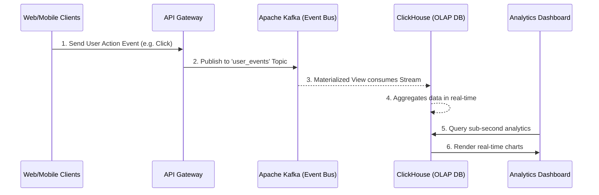

# Real-Time Event Streaming Data Pipeline

Detailed schema and data flow blueprint for migrating legacy batch processing into a sub-10ms latency event-driven architecture.

## Visual Blueprint

## Architecture Summary
- **Message Broker:** Apache Kafka acts as the central nervous system handling millions of events/sec.
- **Analytics DB:** ClickHouse natively ingests Kafka topics and aggregates data on the fly.
- **CDC:** Debezium (optional) captures database changes and pipes them to Kafka.

*Note: This document provides the high-level topology. For detailed config snippets, contact the Codex Neural engineering team.*
