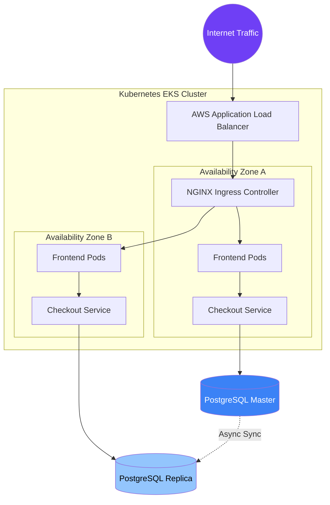

# Zero-Downtime E-Commerce Cluster Topology

High-res topology map demonstrating how we scale e-commerce infrastructure to 50k RPS with instant HPA triggers and Multi-AZ failover.

## Visual Blueprint

## Architecture Summary
- **Orchestration:** Kubernetes (EKS) across multiple Availability Zones for zero downtime.
- **Ingress:** NGINX / ALB handling SSL termination and rate limiting.
- **Database:** PostgreSQL HA via Patroni with async replication.

*Note: This document provides the high-level topology. For detailed config snippets, contact the Codex Neural engineering team.*
