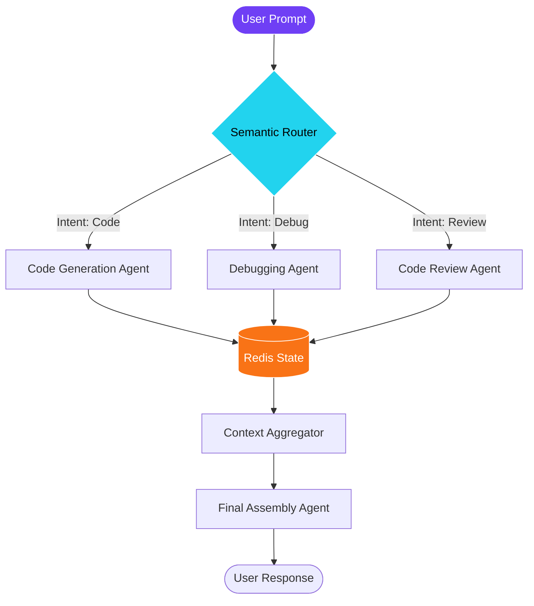

# Multi-Agent State Graph Architecture Blueprint

This is a complete reference architecture detailing our setup for orchestrating 12 independent AI agents with real-time state persistence and tool fallback.

## Visual Blueprint

## Architecture Summary
- **State Persistence:** Redis (Ensures agent memory is maintained across multi-turn conversations)
- **Routing:** Semantic Router (Directs user intent to the most specialized AI agent)
- **Framework:** LangGraph (Manages the cyclical state graph)

*Note: This document provides the high-level topology. For detailed config snippets, contact the Codex Neural engineering team.*
