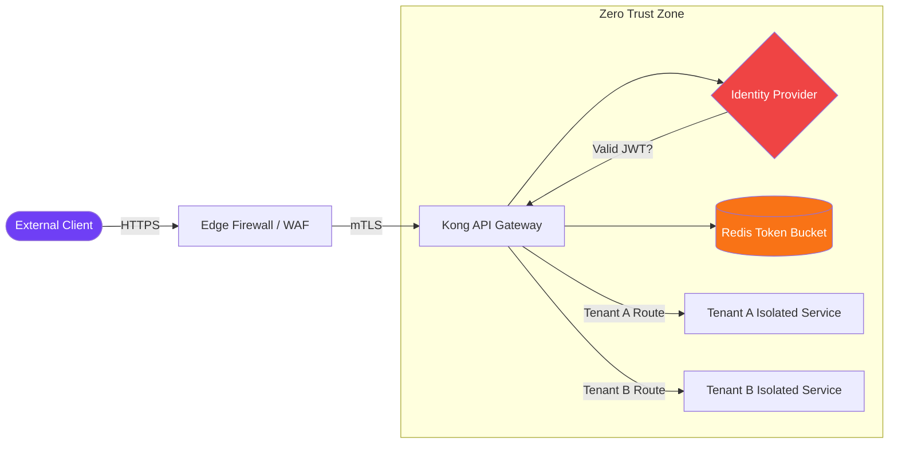

# Zero-Trust Multi-Tenant API Gateway

Actionable blueprint for implementing mTLS, distributed rate limiting, and aggressive JWT edge validation across federated SaaS endpoints.

## Visual Blueprint

## Architecture Summary
- **Gateway:** Kong API Gateway terminates traffic, handles SSL, and routes based on tenant claims.
- **Identity:** All incoming requests must possess a valid cryptographically signed JWT.
- **Rate Limiting:** Redis-backed token buckets enforce strict quotas per tenant to prevent noisy neighbor problems.

*Note: This document provides the high-level topology. For detailed config snippets, contact the Codex Neural engineering team.*
